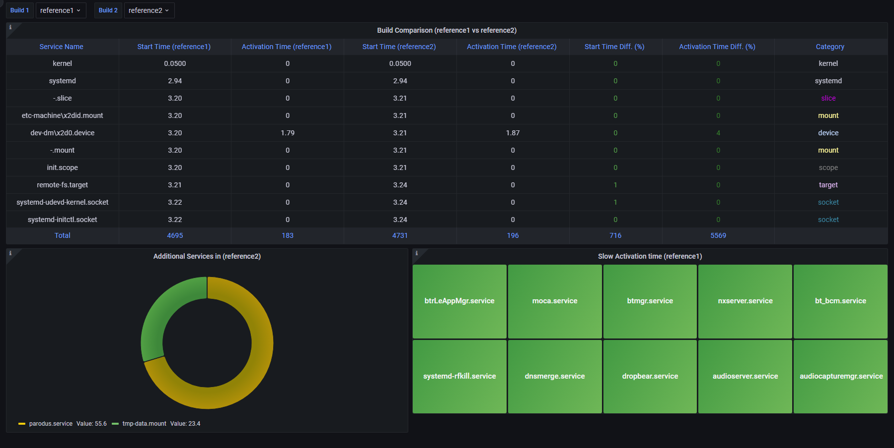

# systemd-analyze plot SVG parser

This is a Python script that extracts systemd service data from systemd-analyze plot command output (SVG format) and stores it in a MySQL database. It parses the SVG file and retrieves relevant data, such as service name, activation time, start time, and category, and then stores that data in a table for each build.

## Requirements

To run this script, you need:

- [Python 3.x](https://www.python.org/downloads/)
- [mysql-connector-python](https://dev.mysql.com/doc/connector-python/en/connector-python-installation.html) library
- [svgelements](https://pypi.org/project/svg-elements/) library
- [MySQL server installed and running](https://dev.mysql.com/downloads/installer/)

## Installations

### MySQL

- Install **MySQL** on your desired OS flavor. The steps to install are available on the MySQL homepage. For developer instances, only use Community Edition. Links:
- Download: [dev.mysql.com](dev.mysql.com)
- Installation: [dev.mysql.com/doc/installing](dev.mysql.com/doc/installing)
- Configure the Port (default **3306**), user (default **root**) and password
- Install [MySQL Workbench](https://dev.mysql.com/downloads/workbench/) as well for easy handling of the Databases

### Grafana

- Install Grafana on your desired OS flavor. The steps are in the Grafana Official Documentation. Link:
  - Download: [grafana.com/download](grafana.com/download)
  - Configure the Port (default **3000**), username (default **admin**) and password (default **admin**)
- Grafana and MySQL Connection
  - Grafana comes with built-in MySQL data source connection Plugin, if not install the MySQL plugin
  - Connect to the MySQL Server from Grafana by providing the MySQL credentials used.
  - The Databases and Tables from MySQL will be accessible
  - Connect Grafana with MySQL using **MySQL Data Source - Native plugin**

## Usage

1. Install the required libraries: `pip install mysql-connector-python svgelements`
2. Run the script with the directories containing your systemd-analyze plot SVG files as arguments. For example: `python3 analyze_plotter.py dir1/ dir2/ dir3/`

File Structure

## Sample Grafana Dashboard
Below is a sample Grafana Dashboard with a few Panels to get insights on the parsed Data from systemd-analyze SVG file

A Sample Dashboard Snapshot
## License

This project is licensed under the [MIT License](https://opensource.org/licenses/MIT). See the LICENSE file for details.
